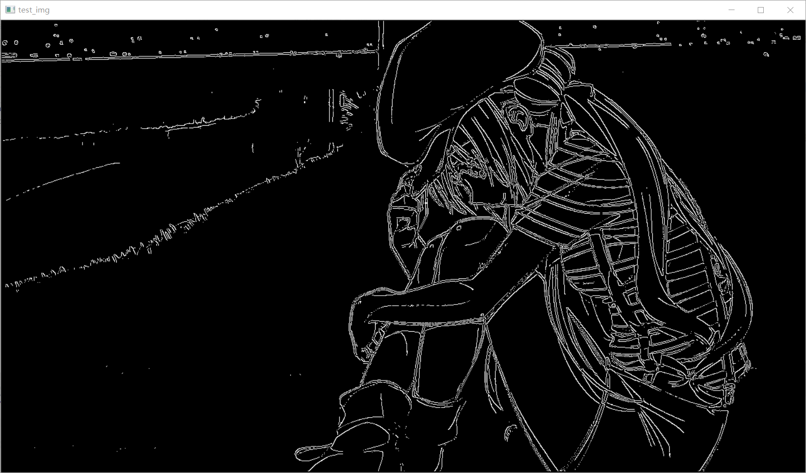

# 数字图像处理综合实验报告

<center><big>软件工程 1804</big></center>

## 一、Canny边缘检测

我们可以直接使用一阶导数算子或者二阶导数算子对图像做卷积来提取图像的边缘，但是这些做法有一定的缺点，一方面是检测的正确率不够高，另一方面提取的边缘不是单像素长的。Canny边缘检测是一种更高级的方法，可以解决上述问题。

Canny边缘检测算法基于如下三个目标提出：

1. 低错误率
2. 边缘点应被很好地定位
3. 单个边缘点响应

Canny算法并不是简单地使用某个卷积核来过滤图像，而是有一套步骤的，Canny算法的步骤大致可以分为如下四步：

1. 高斯滤波（降低噪声，防止虚假边缘）
2. 计算图像的梯度和梯度方向
3. 对梯度图像应用非极大值抑制
4. 使用双阈值处理和连通性分析来检测与连接边缘

其中前两个步骤相当于是朴素的边缘检测算法，第三个步骤是为了将边缘固定为单像素宽，第四个步骤是为了剔除假边缘

#### 详细说明

详细的步骤解释说明如下：

1. 将原始的图像数据与高斯mask作卷积。利用高斯平滑对图像降噪，方便后续的处理
2. 使用Sobel算子滤波，获得x和y方向上的输出，在此基础上求出边缘的强度和角度。其中的强度可由fx与fy的平方和开根号得到，角度则可由fy与fx1的比值取arctan得到。
3. 对边缘角度进行量化处理。直接使用arctan得到的角度计算过于复杂，故可将角度以45度为界划分为0，45，90，135.其中-0.4142 < tan < 0.4142，其余以此类推。
4. 根据边缘角度对边缘强度进行非极大值抑制，细化图像边缘。仅得到全局的梯度不足以确定边缘，必须保留局部梯度最大的点，抑制非极大值。例如，当0度时，取（x，y）、（x+1，y）、（x-1，y）的最大值。
5. 使用双阈值算法检测和连接边缘。减少假边缘段数量的典型方法是对N[i，j]使用一个阈值，将低于阈值的所有值赋零值。双阈值算法对非极大值抑制图象作用两个阈值τ1和τ2，且2τ1≈τ2，从而可以得到两个阈值边缘图象N1［i,j］和N2［i，j］。由于N2［i，j］使用高阈值得到，因而含有很少的假边缘，但有间断(不闭合)。双阈值法要在N2［i，j］中把边缘连接成轮廓，当到达轮廓的端点时，该算法就在N1［i,j］的8邻点位置寻找可以连接到轮廓上的边缘，这样，算法不断地在N1［i,j］中收集边缘，直到将N2［i,j］连接起来为止。

#### 代码实现

```python
import math
import numpy as np
import cv2

def myCanny(image, tl, th):

    #Gauss Blur
    image = cv2.GaussianBlur(image, (5,5), 3.0, sigmaY=3.0)
    print('Gauss Blur down')
    #Gradient Calculation
    gx = cv2.Sobel(image,cv2.CV_16S,1,0) 
    gy = cv2.Sobel(image,cv2.CV_16S,0,1) 
    m = (gx*gx + gy*gy) ** 0.5
    theta = np.zeros(m.shape)
    for x in range(0, m.shape[0]):
        for y in range(0, m.shape[1]):
            if(gx[x][y] == 0):
                theta[x][y] = math.pi/2
            else:
                theta[x][y] = math.atan(gy[x][y]/gx[x][y])
    print('Gradient Calculation down')
    #Non-Maximum Suppression
    gn = m.copy()
    for x in range(0, m.shape[0]):
        for y in range(0, m.shape[1]):
            if math.pi * -1/8 <= theta[x][y] and  theta[x][y] <= math.pi * 1/8:
                target = (0,1,0,-1)
            elif math.pi * 1/8 <= theta[x][y] and  theta[x][y] <= math.pi * 3/8:
                target = (-1,-1,1,1)
            elif math.pi * -3/8 <= theta[x][y] and  theta[x][y] <= math.pi * -1/8:
                target = (1,-1,-1,1)
            else:
                target = (1,0,-1,0)
            if 0 <= x + target[0] and x + target[0] < m.shape[0] and 0 <= y + target[1] and y + target[1] < m.shape[1]:
                if m[x][y] < m[x+target[0]][y+target[1]]:
                    gn[x][y] = 0
            if 0 <= x + target[2] and x + target[2] < m.shape[0] and 0 <= y + target[3] and y + target[3] < m.shape[1]:
                if m[x][y] < m[x+target[2]][y+target[3]]:
                    gn[x][y] = 0
    print('Non-Maximum Suppression down')
    #Dual-threshold edge detection
    gnh = gn.copy()
    gnl = gn.copy()
    for x in range(0, gn.shape[0]):
        for y in range(0, gn.shape[1]):
            if gn[x][y] > 255:                                 
                gn[x][y] = 255
            if gn[x][y] < th:
                gnh[x][y] = 0
            if gn[x][y] < tl:
                gnl[x][y] = 0
    gnl = gnl - gnh
    label = np.zeros(gn.shape)
    s = []
    q = []
    connected = False
    for x in range(0, gn.shape[0]):
        for y in range(0, gn.shape[1]):
            if gnl[x][y] > 0 and label[x][y] == 0:
                label[x][y] = 255
                s.append((x,y))
                q.append((x,y))
                while s:
                    xy = s.pop()
                    target = (-1,-1,-1,0,-1,1,0,-1,0,1,1,-1,1,0,1,1)
                    for i in range(0, 8):
                        tempx, tempy = xy[0] + target[i*2], xy[1] + target[i*2+1]
                        if 0 <= tempx and tempx < gn.shape[0] and 0 <= tempy and tempy < gn.shape[1]:
                            if gnl[tempx][tempy] > 0 and label[tempx][tempy] == 0:
                                label[tempx][tempy] = 255
                                s.append((tempx,tempy))
                                q.append((tempx,tempy))
                            if gnh[tempx][tempy] > 0:
                                connected = True
                if connected == False:
                    while q:
                        xy = q.pop()
                        label[xy[0]][xy[1]] = 0
                q = []
                connected = False
            if gnh[x][y] > 0:
                label[x][y] = 255
    print('Dual-threshold edge detection down')
    return label.astype(np.uint8)
    
    

image = cv2.imread("lena.jpg", 0)
mycanny = myCanny(image,20,100)
cvcanny = cv2.Canny(image, 20,100)
cv2.imshow('image', image)
cv2.imshow('myCanny', mycanny)
cv2.imshow('OpencvCanny', cvcanny)
k = cv2.waitKey(0)
if k == 27:       # wait for ESC key to exit     
    cv2.destroyAllWindows()


```

#### 实验结果


<center>处理前的图像</center>



<center>处理后的图像</center>

## 二、OSTU图像分割方法

大津法（OTSU）是一种确定图像二值化分割阈值的算法，是求图像全局阈值的最佳方法。

**优点**：计算简单快速，不受图像亮度和对比度的影响。

**缺点**：对图像噪声敏感；只能针对单一目标分割；当目标和背景大小比例悬殊、类间方差函数可能呈现双峰或者多峰，这个时候效果不好。

#### 基本原理

由于一个图像的不同区域的差别较大，我们可以用这个原理来设计算法。图像不同区域的差别可以用方差来刻画。

假设有一个阈值TH能把图像分割成两个区域，均值分别为m1,m2。像素被分到两个区域的概率位p1，p2，则整个图像的均值可以被表示为：

$$
m = p_1m_1+p_2m_2
$$

类间方差可以表示为：

$$
\sigma^2=p_1(m_1-m)^2+p_2(m_2-m)^2
$$

化简得：

$$
\sigma^2=p_1p_2(m_1-m_2)^2
$$

使上面这个式子最大化的TH即要求的阈值。

#### 代码实现

```python
import math
import numpy as np
import cv2

def myOtsu(image):
    n = np.zeros(256,dtype=int)
    for x in range(image.shape[0]):
        for y in range(image.shape[1]):
            n[image[x][y]] += 1
    p = n / sum(n)
    p1 = np.zeros(256)
    m = np.zeros(256)
    for k in range(0, 256):
        p1[k] = sum(p[:k+1])
        if k > 0:
            m[k] = m[k-1] + k * p[k]
    mg = m[255]
    varB = np.zeros(256)
    for k in range(0, 256):
        if p1[k] > 0 and p1[k] < 1:
            varB[k] = ((mg * p1[k] - m[k]) ** 2) / (p1[k] * (1 - p1[k]))
    resultList = []
    for k in range(0, 256):
        if varB[k] == np.amax(varB):
            resultList.append(k)
    result = np.average(resultList).astype(np.uint8)
    print(result)
    newImage = np.zeros(image.shape)
    for x in range(image.shape[0]):
        for y in range(image.shape[1]):
            if image[x][y] > result:
                newImage[x][y] = 255
    return newImage

image = cv2.imread('3.jpg',0)
new = myOtsu(image)
cv2.imshow('image', new)
k = cv2.waitKey(0)
if k == 27:       # wait for ESC key to exit     
    cv2.destroyAllWindows()
```

